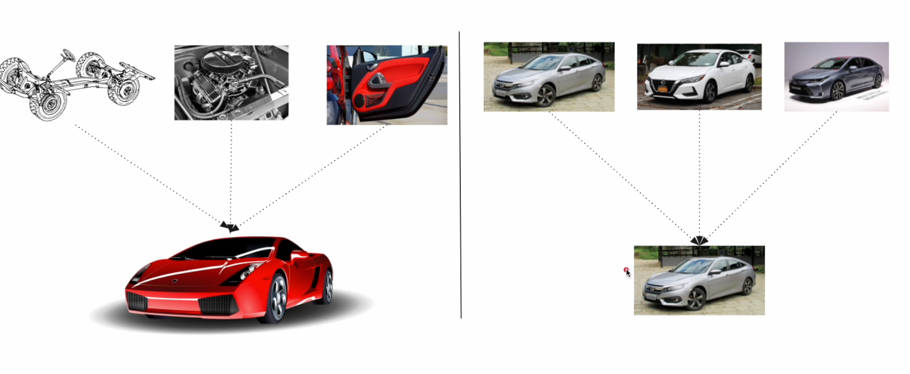
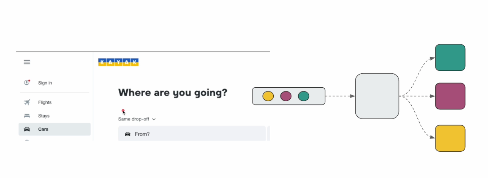

## Microservices Design Patterns

### Gateway Aggregator Pattern

### Scatter Gather Pattern

### Difference between Gateway Aggregator Pattern & Scatter Gather Pattern

### Service Orchestrator Pattern - Parallel

#### Service Layer Implementation - Parallel

### Service Orchestrator Pattern - Sequential

#### Service Layer Implementation - Sequential

### Splitter Pattern

